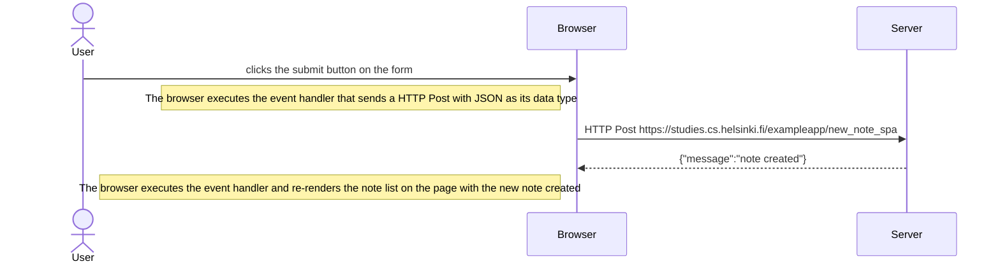

```mermaid
sequenceDiagram
    actor User
    participant Browser
    participant Server
    User ->> Browser: clicks the submit button on the form
    Note left of Browser: The browser executes the event handler that sends a HTTP Post with JSON as its data type
    Browser->>Server: HTTP Post https://studies.cs.helsinki.fi/exampleapp/new_note_spa
    Server-->>Browser: {"message":"note created"}
    Note left of Browser: The browser executes the event handler and re-renders the note list on the page with the new note created
```