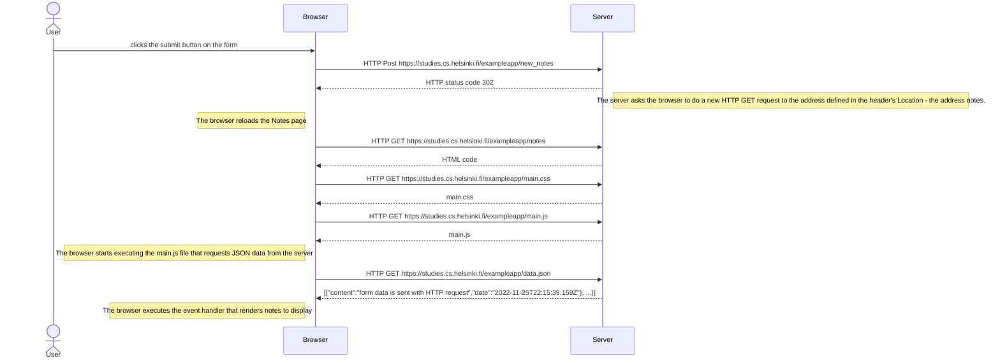

```mermaid
sequenceDiagram
    actor User
    participant Browser
    participant Server
    User ->> Browser: clicks the submit button on the form
    Browser->>Server: HTTP Post https://studies.cs.helsinki.fi/exampleapp/new_notes
    Server-->>Browser: HTTP status code 302
    Note right of Server: The server asks the browser to do a new HTTP GET request to the address defined in the header's Location - the address notes.
    Note left of Browser: The browser reloads the Notes page
    Browser->>Server:  HTTP GET https://studies.cs.helsinki.fi/exampleapp/notes
    Server-->>Browser: HTML code
    Browser->>Server:  HTTP GET https://studies.cs.helsinki.fi/exampleapp/main.css
    Server-->>Browser: main.css
    Browser->>Server:  HTTP GET https://studies.cs.helsinki.fi/exampleapp/main.js
    Server-->>Browser: main.js
    Note left of Browser: The browser starts executing the main.js file that requests JSON data from the server
    Browser->>Server:  HTTP GET https://studies.cs.helsinki.fi/exampleapp/data.json
    Server-->>Browser: [{"content":"form data is sent with HTTP request","date":"2022-11-25T22:15:39.159Z"}, ...}]
    Note left of Browser: The browser executes the event handler that renders notes to display
```