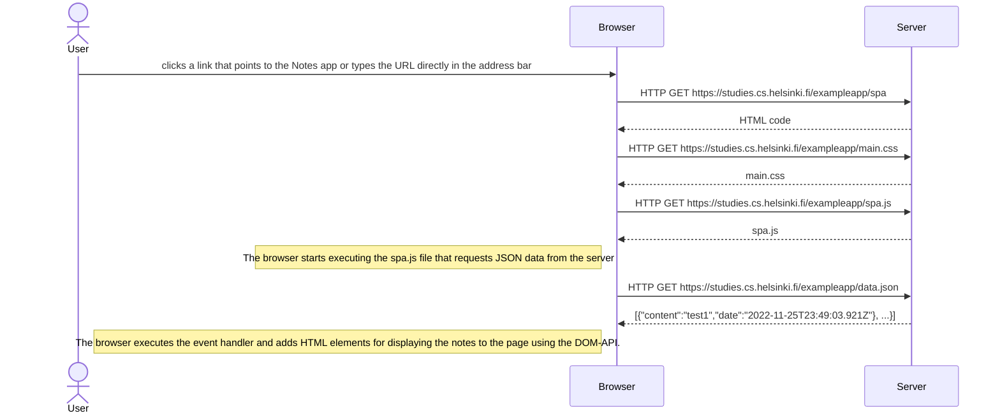

```mermaid
sequenceDiagram
    actor User
    participant Browser
    participant Server
    User ->> Browser: clicks a link that points to the Notes app or types the URL directly in the address bar
    Browser->>Server:  HTTP GET https://studies.cs.helsinki.fi/exampleapp/spa
    Server-->>Browser: HTML code
    Browser->>Server:  HTTP GET https://studies.cs.helsinki.fi/exampleapp/main.css
    Server-->>Browser: main.css
    Browser->>Server:  HTTP GET https://studies.cs.helsinki.fi/exampleapp/spa.js
    Server-->>Browser: spa.js
    Note left of Browser: The browser starts executing the spa.js file that requests JSON data from the server
    Browser->>Server:  HTTP GET https://studies.cs.helsinki.fi/exampleapp/data.json
    Server-->>Browser: [{"content":"test1","date":"2022-11-25T23:49:03.921Z"}, ...}]
    Note left of Browser: The browser executes the event handler and adds HTML elements for displaying the notes to the page using the DOM-API.
```